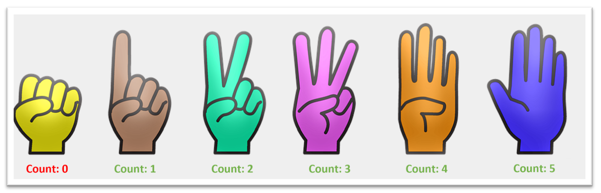
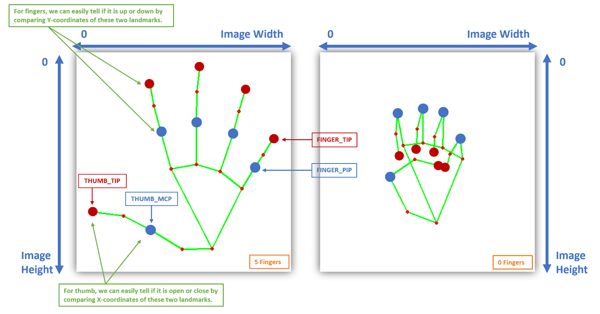

# Hand-Gesture-Detection-using-OpenCV
This is a project for the class: 18CSC305J - Artificial Intelligence

## Problem Statement
To utilize the landmarks to count and fingers (that are up) in images and videos and create a real-time hand counter. and also to create a hand finger recognition and visualization application that will display the exact fingers that are up.  This will work for both hands.

## Abstract
We will build a Selfie-Capturing System that will be controlled using hand gestures to enhance the user experience. So we will be able to capture images and also turn an image filter on/off without even touching our device. We will also work on a Hand Gesture Recognizer that will be capable of identifying multiple gestures.

## Societal Benefit
It provides the ability to interact with computers and devices without physically touching them 
The integration of multiple technologies with gesture control will create innovative opportunities in many sectors

## Description
We will automatically trigger the required keypress events, depending upon the hand movements of the person that we’ll capture using Mediapipe’s Pose Detection model.

###
Below are the results on a few sample images but this will also work on camera feed in real-time and on recorded videos as well.
You will not need any expensive GPU, your CPU will suffice as the whole code is highly optimized
 &ensp;

###
Utilizing the landmarks to count the number of fingers up of each hand in the image/frame and will return the count and the status of each finger in the image as well.
 &ensp;

###
To check the status of each finger (i.e., either it is up or not), we will compare the y-coordinates of the FINGER_TIP landmark and FINGER_PIP landmark of each finger. Whenever the finger will be up, the y-coordinate of the FINGER_TIP landmark will have a lower value than the FINGER_PIP landmark. 
But for the thumbs, the scenario will be a little different as we will have to compare the x-coordinates of the THUMB_TIP landmark and THUMB_MCP landmark and the condition will vary depending upon whether the hand is left or right.
 &ensp;

###
The hand print will be Red if that particular hand (i.e., either right or left) is not present in the image/frame. 
The hand print will be Green if the hand is present in the image/frame. 
The fingers of the hand print, that are up, will be highlighted by with the Orange color and the fingers that are down, will remain Green.
 &ensp;

###
We have the .png images of the hands and fingers prints in the required colors (red, green, and orange) with transparent backgrounds, so we will only need to select the appropriate images depending upon the hands and fingers statuses and overlay them on the image/frame. 
 &ensp;

## Outline
Step 1:  Perform Hands Landmarks Detection 
Step 2:  Build the Fingers Counter 
Step 3:  Visualize the Counted Fingers 
Step 4:  Build the Hand Gesture Recognizer 
Step 5:  Build a Selfie-Capturing System controlled by Hand Gestures

## Teck Stack Used
Python, Opencv, Mediapipe

